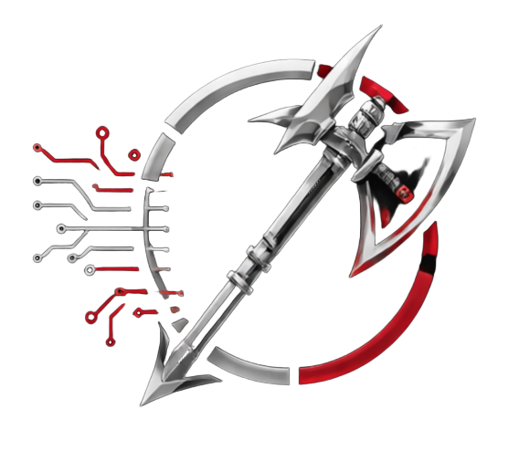
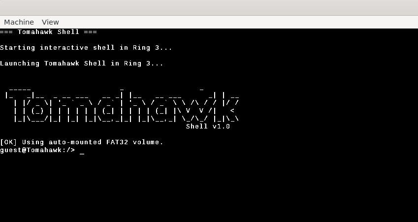
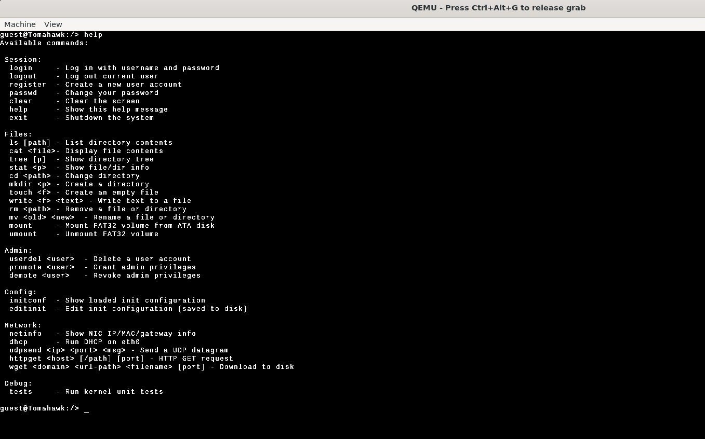
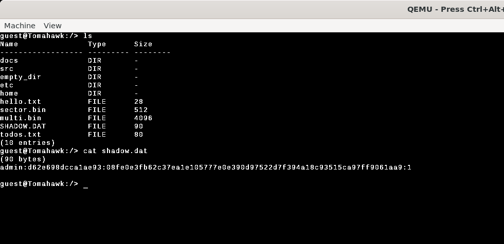

<p align="center">
  
</p>

<h1 align="center">TomahawkOS</h1>

<p align="center">
  <b>A 64-bit operating system built from scratch for learning, exploration, and deep understanding of how computers really work.</b>
</p>

<p align="center">
  
  
  
  
  
</p>

---

## About

TomahawkOS is a bare-metal x86_64 operating system written entirely in C and assembly. It was developed as a 12th-grade final project at **Magshimim** — Israel's national cyber education program — to gain hands-on understanding of every layer of a modern OS: from UEFI boot to TCP/IP networking.

This is an educational project. Every subsystem — bootloader, memory manager, scheduler, filesystem, network stack, and shell — was implemented from the ground up without relying on any existing OS kernel code.

---

## Features

### Core

| Component | Description |
|---|---|
| **UEFI Bootloader** | GNU-EFI application that configures GOP framebuffer, loads the kernel ELF, and passes a memory map to the kernel |
| **4-Level Paging** | Full x86_64 virtual memory with identity mapping, page fault handling, and Copy-on-Write support |
| **Frame Allocator** | Physical frame allocator seeded from the UEFI memory map |
| **GDT / IDT** | Global Descriptor Table and Interrupt Descriptor Table configured for ring 0 / ring 3 separation |
| **Process Model** | PCB/TCB structures, `fork()` with COW, ELF binary loading, per-process file descriptors |
| **Cooperative Scheduler** | Round-robin thread scheduling with full register context switching (assembly) |
| **Syscall Interface** | Ring 3 → Ring 0 transitions via the `SYSCALL` instruction; ~30 system calls |
| **Signal Handling** | POSIX-style signals (32 types) with default and user-defined handlers |

### Filesystem

| Component | Description |
|---|---|
| **VFS Layer** | Vnode/mount-point abstraction supporting multiple filesystem backends |
| **Ramfs** | In-memory filesystem used as the root (`/`) |
| **FAT32 Driver** | Full read/write FAT32 with Long File Name (LFN) support over an ATA block device |
| **Initrd** | Cpio newc archive unpacked at boot to populate `/etc`, `/bin`, and the userland root |
| **Pipes** | 4 KiB ring-buffer IPC between processes |

### Networking

| Layer | Implementation |
|---|---|
| **NIC Driver** | Intel e1000 (82540EM) — PCI enumeration, MMIO, 8 TX/RX descriptors |
| **Ethernet** | Frame TX/RX, EtherType demuxing |
| **ARP** | 32-entry cache, request/reply resolution |
| **IPv4** | Packet routing, TTL, protocol demuxing, checksum |
| **ICMP** | Echo request/reply (`ping`) |
| **UDP** | Port-based bind table with send/recv |
| **TCP** | Synchronous client — 3-way handshake, sequence/ack tracking |
| **DHCP** | Full Discover → Offer → Request → Ack client |
| **DNS** | A-record resolver (RFC 1035) with compressed name pointer support |
| **HTTP** | GET client with hostname resolution and response parsing |

### User Interface

| Component | Description |
|---|---|
| **VGA Framebuffer** | 32-bit BGRA rendering with auto-scaling fonts (8×16 for 1080p, 16×32 for 4K) |
| **PS/2 Keyboard** | IRQ1 driver with scancode set 1, shift/ctrl modifiers, Ctrl+C / Ctrl+Z |
| **TTY** | Line-editing terminal with cursor movement, history browsing, Home/End/Delete |
| **Serial (UART)** | COM1 debug output for kernel logging |

### Security

| Component | Description |
|---|---|
| **User Accounts** | UID-based user model with admin (uid 0) and guest accounts |
| **Password Store** | SHA-256 salted password hashing, persisted to `/etc/shadow` |
| **Permission Model** | Home directory confinement for non-admin users |

---

## Shell Commands

TomahawkOS includes an interactive shell called **Tomahawk** with the following built-in commands:

```
ls [path]              List directory contents
cat <file>             Display file contents
mkdir <path>           Create a directory
touch <file>           Create an empty file
write <file>           Write to a file (interactive)
pwd                    Print working directory
cd <path>              Change directory
tree [path]            Display directory tree

useradd <user>         Create a user account
userdel <user>         Delete a user account
passwd                 Change current user's password
logout                 End session

ping <ip>              Send ICMP echo request
httpget <host> <path>  HTTP GET request
```

---

## Building

### Prerequisites

TomahawkOS builds on **Linux** (WSL Ubuntu 22.04+ recommended). A setup script is provided to install everything automatically:

```bash
chmod +x dependencies.sh
./dependencies.sh
```

This installs:
- `x86_64-elf-gcc` 13.2.0 cross-compiler (built from source)
- `x86_64-linux-gnu-gcc` and GNU-EFI (for the UEFI bootloader)
- `nasm`, `mtools`, `dosfstools`, `cpio`
- QEMU with OVMF firmware

Use `--skip-cross` if the cross-compiler is already installed.

### Build & Run

```bash
# Full clean build + launch in QEMU
bash rerun

# Quick re-launch (no rebuild)
bash run

# Resolution options: 768, 1080 (default), 1440, 4k
bash rerun 4k
```

### Manual Build

```bash
cd src
make all        # Build bootloader, kernel, user binary, initrd, and disk image
make clean      # Clean all build artifacts
```

---

## Project Structure

```
├── dependencies.sh          Setup script (installs all build dependencies)
├── create_fat32_test.sh     Generates a FAT32 test disk image
├── run                      Quick-launch QEMU
├── rerun                    Clean build + launch QEMU
│
├── src/
│   ├── makefile             Top-level build: disk image, initrd
│   │
│   ├── bootloader/          UEFI bootloader (GNU-EFI)
│   │   └── src/
│   │       ├── main.c       EFI entry — GOP, memory map, ELF load
│   │       ├── elf.c        ELF64 parser
│   │       ├── fs.c         UEFI filesystem access
│   │       └── ...
│   │
│   ├── kernel/              Kernel (bare-metal C + x86_64 ASM)
│   │   └── src/
│   │       ├── kernel.c     Kernel main — init sequence
│   │       ├── paging.c     4-level page tables
│   │       ├── scheduler.c  Cooperative round-robin scheduler
│   │       ├── fat32.c      FAT32 filesystem driver
│   │       ├── e1000.c      Intel NIC driver
│   │       ├── tcp.c        TCP client implementation
│   │       ├── shell_fs_cmd.c  Shell command interpreter
│   │       └── ...
│   │
│   └── user/                Usermode test binary (ring 3)
│       └── src/
│           └── user_main.c  Minimal syscall test program
│
├── tools/                   Font bitmap generators
│
└── userland_root/           Initial ramdisk contents
    ├── etc/
    │   ├── init.cfg         Boot configuration
    │   ├── passwd           User accounts
    │   ├── shadow           Password hashes
    │   └── ...
    └── ...
```

---

## Architecture Overview

```
┌──────────────────────────────────────────────────┐
│                   User Space (Ring 3)            │
│                    user_main.c                   │
├──────────────────────────────────────────────────┤
│                  SYSCALL Interface                │
├──────────────────────────────────────────────────┤
│  Shell    │  Scheduler  │  Signals  │  Pipes     │
├───────────┼─────────────┼───────────┼────────────┤
│  VFS (ramfs + FAT32)    │  Process Manager       │
├─────────────────────────┼────────────────────────┤
│  FAT32    │  Block Dev  │  Frame Alloc │ Paging  │
├───────────┴─────────────┴────────────┴───────────┤
│  Network Stack: ETH → ARP → IPv4 → UDP/TCP/ICMP │
│  DHCP │ DNS │ HTTP                               │
├──────────────────────────────────────────────────┤
│  e1000 NIC  │  ATA Disk  │  VGA  │  PS/2  │ TTY │
├──────────────────────────────────────────────────┤
│  IDT / GDT / Timer / HAL (Port I/O)             │
├──────────────────────────────────────────────────┤
│              UEFI Bootloader (GNU-EFI)           │
└──────────────────────────────────────────────────┘
```

---

## Screenshots

<p align="center">
  
  
  
</p>

---

## Acknowledgments

- Built as a 12th-grade final project at [Magshimim](https://www.magshimim.cyber.org.il/) — Israel's national cyber education program
- [lonesha256](https://github.com/peterferrie/lonesha256) — public domain single-file SHA-256 implementation
- [GNU-EFI](https://sourceforge.net/projects/gnu-efi/) — UEFI application development framework
- [OSDev Wiki](https://wiki.osdev.org/) — invaluable reference for bare-metal OS development
- [OVMF](https://github.com/tianocore/edk2) — UEFI firmware for QEMU

---

## License

This project is released under the [MIT License](LICENSE).

---

<p align="center">
  <sub>Built with ❤️ to understand what happens below <code>main()</code>.</sub>
</p>
